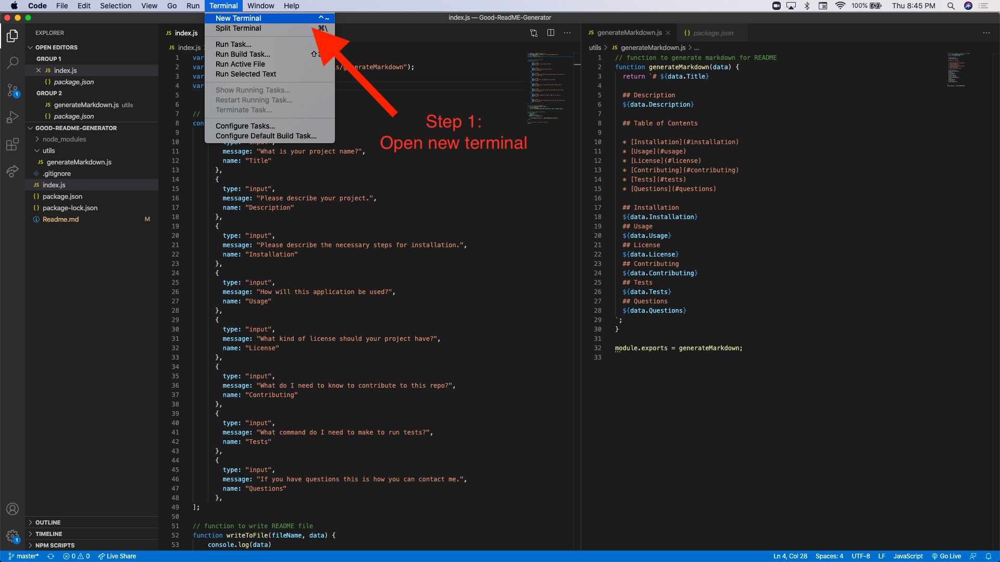
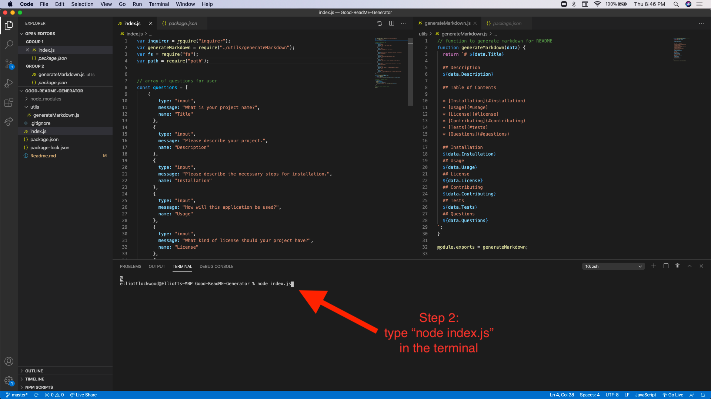
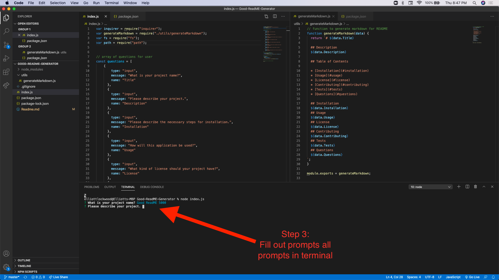
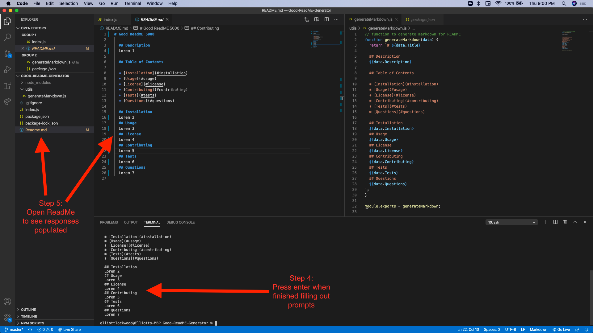

# Good ReadME 5000

  ## Description
  For this project I built an application in the Command Line that generates a readme markdown file for the user

  ## Table of Contents 

  * [Installation](#installation)
  * [Usage](#usage)
  * [License](#license)
  * [Contributing](#contributing)
  * [Tests](#tests)
  * [Questions](#questions)
  
  ## Installation
         
  ## Usage
  This application will be used to more effciently generate readme's for users
  ## License
  MIT
  ## Contributing
  You need to be very familiar with the command line and understand "node.js"
  ## Tests
  "node index.js"
  ## Questions
  ejl@aol.com
